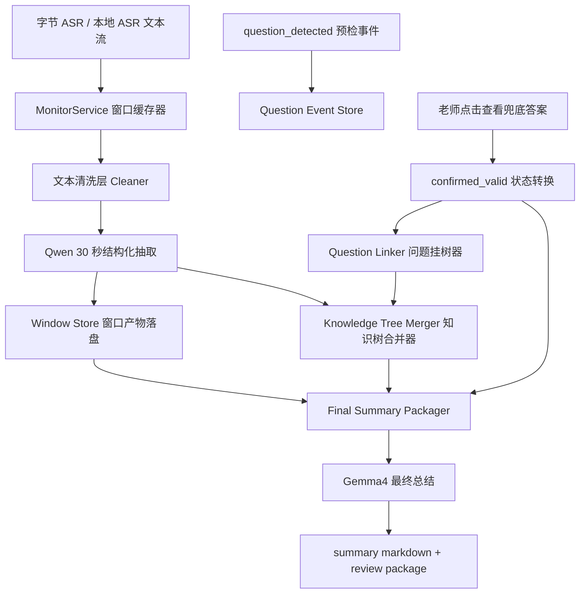

# v1.1.2 改造指导文件

## 双阶段本地总结系统 Todo List（面向编程型 AI 的执行版）

本文基于当前 `v1.1` 仓库结构整理，面向 `Codex`、`Claude` 等编程类 AI 使用。目标不是继续沿用“滚动摘要 + 课后总结”的松散链路，而是把当前项目重构为一个可调试、可回放、可演进的双阶段本地总结系统：

- 第一层：`Qwen` 实时结构化整理层
- 第二层：`Gemma4` 课后最终总结层

当前文档不是讨论稿，而是后续自动化改码代理的实施约束、模块蓝图和任务拆解清单。

适用范围：

- 项目根目录：`/Users/hooked4st/v1.1`
- 当前后端：`FastAPI`
- 当前前端：`React + Vite + Tauri`
- 当前主链路：`ASR -> monitor_service -> WebSocket/question_router -> LLMService -> FallbackPanel -> timeline/current_session.json`
- 当前课后总结链路：`stop_monitor -> summary_service -> transcript_service.get_summary_context -> llm_service.generate_class_summary -> data/summaries/*.md`

面向 AI 执行时的理解方式：

- 优先把本文当成“实施约束 + 任务拆解文档”，不是产品方案汇报
- 如果文档与仓库现状冲突，以仓库现状和本文中的“当前项目现状”章节为准
- 如果要生成具体改码计划，应优先遵守本文中的“推荐实施顺序”和“最高优先级清单”
- 除非本文明确要求，否则不要顺手重构无关模块，不要扩大范围

---

## 零、硬性限制

以下限制对后续 Codex / Claude 等编程类 AI 属于强约束：

1. 不要把整堂课原始 ASR 文本直接送给 `Gemma4`。
2. `Qwen` 的职责必须收敛为“实时结构化整理”，不能继续兼任最终长总结。
3. `Gemma4` 的职责必须收敛为“基于中间产物做课后总结”，不能继续直接吃 `TranscriptService.get_summary_context()` 这种半压缩半原文的输入。
4. `字节 ASR` 已接入，不要重做 ASR。
5. “有效问题”的判定必须明确绑定老师点击“查看兜底答案”这一动作，不能把所有 `question_detected` 都当成有效问题。
6. 有效问题不能孤立存放，必须进入知识树或明确挂到“待确认挂载”位置。
7. 本轮改造重点是后端编排、数据结构、持久化和前端最小必要展示，不是重做整体 UI 风格。
8. 前端改造优先复用现有组件和窗口：
   - `QuestionCard.tsx`
   - `FallbackPanel.tsx`
   - `TimelinePanel.tsx`
   - `SummaryGenerationPanel.tsx`
   - `ToolBar.tsx`
9. 所有新能力都必须可调试、可回放、可落盘，不能只存在内存。
10. 必须保留当前本地模型前提：
   - 实时处理模型：`qwen2.5:1.5b` 或同职责 Qwen 模型
   - 最终总结模型：`gemma4:e4b`

对 AI 的执行偏好：

- 优先改 `backend/services`
- 次优先改 `backend/routers`
- 再改 `frontend/src/services/api.ts` 与 `frontend/src/hooks/useWebSocket.ts`
- 最后才改展示层组件

---

## 零点五、分批执行与交接协议

由于代理上下文窗口有限，本文不能按“一次性完成全部改造”来执行。后续 Codex / Claude 等编程型 AI 必须按“小任务包”推进，每次只完成一小批明确目标，并在结束前回写进度，供下一个 agent 接力。

### 执行原则

1. 每次只做一个小任务包，禁止一次跨越多个大阶段。
2. 每次任务包以 `1` 到 `3` 个主任务为上限，且这些任务必须强相关。
3. 如果某项任务会牵连大量前后端和文档联动，必须继续向下拆，不要一次吃完。
4. 每次结束时，必须更新本文中的完成标记，不允许只改代码不回写 Todo。
5. 每次结束时，必须补一段“交接记录”，告诉下一个 agent：
   - 本次完成了什么
   - 改了哪些文件
   - 哪些任务已经完成
   - 哪些任务完成了一半
   - 下一次最适合继续做哪几项
6. 如果任务未完成，不要勾选完成；可在交接记录中注明“进行到哪一步”。

### 勾选规则

- `[ ]` 表示未开始
- `[x]` 表示本项已完成并已验证落盘
- `[~]` 表示部分完成，但还不能算完成

### 每次结束时必须追加的交接记录格式

```md
### Batch N

- 日期：YYYY-MM-DD
- 执行者：Codex / Claude / 其他 agent 名称
- 本次目标：
  - 任务 A
  - 任务 B
- 实际完成：
  - 已完成项 1
  - 已完成项 2
- 修改文件：
  - path/a
  - path/b
- Todo 状态变更：
  - `[x]` 第 X 项
  - `[~]` 第 Y 项
- 遗留问题：
  - 问题 1
  - 问题 2
- 建议下次继续：
  - 下一批先做什么
```

---

## 一、先看当前项目现状

在开始改造前，先统一对当前仓库的判断，后续开发都以这部分为事实基础。

### 1. 当前总结链路的真实落点

- 当前实时摘要在 `backend/services/monitor_service.py`
  - 通过 `SUMMARY_TRIGGER_LINES = 12` 按“累计 12 条文本”触发
  - 调用 `LLMService.generate_realtime_summary_if_enabled()`
  - 产物只有：
    - `_rolling_summary`
    - `_summary_cards`
  - 这些产物最终写回 `data/class_transcript.txt` 的“历史滚动摘要”块
- 当前课后总结在 `backend/services/summary_service.py`
  - 输入来自 `TranscriptService.get_summary_context(max_recent_lines=40)`
  - 当前输入是“滚动摘要 + 最近原始转录”
  - 仍不是专门为最终总结设计的结构化包
- 当前最终总结提示词在 `backend/services/llm_service.py::generate_class_summary`
  - 仍以“课堂压缩记录”作为主输入
  - 尚未引入知识树、问题挂接关系、阶段窗口摘要包

### 2. 当前提问检测与“有效问题”链路的真实落点

- `monitor_service.py` 在 ASR 文本中做学生提问句预检
- 命中后通过 WebSocket 推送 `question_detected`
- 前端 `useWebSocket.ts` 接收后显示 `QuestionCard.tsx`
- 老师点击“查看兜底答案”后：
  - `App.tsx::handleViewAnswer()` 打开 `FallbackPanel.tsx`
  - `FallbackPanel.tsx` 请求 `/api/question/answer`
  - `App.tsx::onAnswerLoaded()` 自动调用 `/api/timeline/add`
- 也就是说，当前仓库已经有一个“老师查看答案 -> 写入时间轴”的雏形
- 但这个雏形还不够：
  - 当前只写入 `data/timeline/current_session.json`
  - 没有状态机
  - 没有 `confirmed_valid`
  - 没有知识树挂接
  - 没有答案卡片 ID 或知识点 ID 关联

### 3. 当前结构化课堂状态的真实落点

- 当前 `backend/services/session_state_service.py` 已有 `classroom_state.json`
- 已维护：
  - `current_topic`
  - `topic_summary`
  - `recent_questions`
  - `recent_answers`
  - `student_confusion_points`
  - `recent_transcript_window`
- 这说明项目已经有“结构化课堂状态”的基础
- 但仍然是扁平状态，不是知识树

### 4. 当前数据落盘的真实情况

当前 `data/` 目录已经存在以下运行期文件：

- `data/class_transcript.txt`
- `data/classroom_state.json`
- `data/current_class_material.txt`
- `data/timeline/current_session.json`
- `data/summaries/*.md`
- `data/debug/local_llm_events.jsonl`

问题在于：

- 没有按 `session_id` 隔离
- 没有窗口级中间产物
- 没有知识树快照
- 没有有效问题状态文件
- 没有最终总结输入包

### 5. 当前项目前后端边界

当前应优先改造的文件边界如下：

- 后端服务层
  - `backend/services/monitor_service.py`
  - `backend/services/summary_service.py`
  - `backend/services/session_state_service.py`
  - `backend/services/transcript_service.py`
  - `backend/services/llm_service.py`
  - `backend/services/prompt_builder.py`
- 后端路由层
  - `backend/routers/monitor_router.py`
  - `backend/routers/question_router.py`
  - `backend/routers/timeline_router.py`
  - `backend/main.py`
- 前端主链路
  - `frontend/src/App.tsx`
  - `frontend/src/hooks/useWebSocket.ts`
  - `frontend/src/services/api.ts`
  - `frontend/src/components/QuestionCard.tsx`
  - `frontend/src/components/FallbackPanel.tsx`
  - `frontend/src/components/TimelinePanel.tsx`
  - `frontend/src/components/SummaryGenerationPanel.tsx`
  - `frontend/src/components/ToolBar.tsx`

### 6. 结论

当前项目不是从零开始做双阶段总结，而是在已有基础上做结构升级：

1. 已有 `Qwen/Gemma4` 模型职责雏形，但边界还不干净。
2. 已有实时摘要，但触发条件是“按条数”，不是“按 30 秒窗口”。
3. 已有“老师查看答案 -> 时间轴记录”的行为链路，但还不是“有效问题正式入树”。
4. 已有 `classroom_state.json`，但还不是知识树。
5. 已有课后总结落盘，但输入仍偏旧，不够结构化。

---

## 二、v1.1.2 总目标

将当前课堂助手的总结链路改造成两层：

### 第一层：Qwen 实时处理层

负责处理字节 ASR 的课堂转文字流，不做最终总结，只做：

- 课堂文本清洗
- 30 秒窗口的阶段性总结
- 当前知识点抽取
- 知识树增量更新
- 有效学生问题挂载

### 第二层：Gemma4 最终总结层

负责读取 `Qwen` 处理后的中间结果，而不是直接读取整堂课原始转写，完成课后的课堂大总结。

---

## 三、新的系统架构图说明



### 模块职责划分

#### 1. 采集与窗口层

- `monitor_service.py`
  - 接 ASR 回调
  - 做窗口缓存和触发
  - 广播转录、窗口、问题事件
- `transcript_service.py`
  - 保留原始转录
  - 提供 session 范围内的读写能力

#### 2. 实时结构化层

- 新增 `window_summary_service.py`
  - 负责 30 秒窗口聚合
  - 调用 Qwen 输出结构化 JSON
- 新增 `transcript_cleaner.py`
  - 负责规则清洗与日志
- 新增 `knowledge_tree_service.py`
  - 负责知识树合并、去重、落盘

#### 3. 问题状态层

- 新增 `question_event_service.py`
  - 负责 `detected -> answered -> confirmed_valid -> linked_to_tree`
- 改造 `timeline_router.py`
  - 从“时间轴路由”升级为“问题回顾 + 有效问题索引入口”

#### 4. 最终总结层

- 改造 `summary_service.py`
  - 从“直接拿 transcript summary”升级为“读取最终输入包”
- 新增 `final_summary_packager.py`
  - 负责知识树、阶段摘要、有效问题、关键原文片段的打包

#### 5. 前端展示层

- `QuestionCard.tsx`
  - 保留安静提示入口
- `FallbackPanel.tsx`
  - 成为有效问题确认链路的一部分
- `TimelinePanel.tsx`
  - 升级为问题回顾面板
- 新增或扩展知识树展示组件
  - 优先复用 `ToolBar.tsx` 区域或新增轻量侧板
- `SummaryGenerationPanel.tsx`
  - 课后支持同时回看知识树与问题轨迹

---

## 四、数据流设计

### A. 实时阶段数据流

1. `ASR` 返回文本片段
2. `monitor_service.py` 写入原始 transcript
3. 文本进入 30 秒窗口缓存器
4. 窗口结束后交给清洗层
5. 清洗结果交给 `Qwen` 提示词
6. `Qwen` 输出：
   - `cleaned_text`
   - `stage_summary`
   - `topics / subtopics / concepts / relations / facts / examples`
   - `candidate_question_links`
7. 输出保存到 `windows/`
8. 知识树合并器据此更新 `knowledge_tree/`
9. 前端收到 `summary_update` 之外的新 `knowledge_tree_update`

### B. 问题确认与挂树数据流

1. `monitor_service.py` 广播 `question_detected`
2. `QuestionCard.tsx` 显示安静提示
3. 老师点击“查看兜底答案”
4. `FallbackPanel.tsx` 获取短答
5. 前端立即调用“确认有效问题”接口，而不是只写 `timeline/add`
6. 后端把该问题状态转换为：
   - `detected`
   - `answered`
   - `confirmed_valid`
7. 问题挂树器尝试将其挂到当前知识点
8. 若定位失败，挂到当前主主题并标记 `unresolved_link`
9. 前端收到 `question_linked` 或 `question_pending_link`

### C. 最终总结数据流

1. `stop_monitor`
2. `summary_service.py` 不再直接读取 `get_summary_context()`
3. 改为调用 `final_summary_packager.py`
4. 打包以下内容：
   - 当前 session 的知识树快照
   - 全部窗口摘要
   - 全部有效问题
   - 问题与知识点关系
   - 主题演进路径
   - 必要的少量关键原文片段
5. `Gemma4` 读取该包生成最终总结
6. 保存：
   - `final_summary_input_package.json`
   - `final_summary.md`

---

## 五、数据结构定义

以下结构是 `v1.1.2` 必须落地的核心数据模型。

### 1. Session 元信息

```json
{
  "session_id": "20260409_030512_high_school_history_01",
  "subject": "历史",
  "course_name": "高中历史",
  "material_name": "鸦片战争讲义.txt",
  "started_at": "2026-04-09T03:05:12+08:00",
  "ended_at": "",
  "chat_model": "qwen2.5:1.5b",
  "final_summary_model": "gemma4:e4b",
  "status": "active"
}
```

### 2. 窗口产物 Window Record

```json
{
  "window_id": "w_0007",
  "session_id": "20260409_030512_high_school_history_01",
  "start_time": "03:12:00",
  "end_time": "03:12:30",
  "raw_text": "[03:12:01] ...",
  "cleaned_text": "本窗口保留后的课堂表述",
  "stage_summary": "30 秒阶段摘要",
  "extracted_topics": ["鸦片战争背景"],
  "extracted_subtopics": ["白银外流", "贸易逆差"],
  "extracted_concepts": ["闭关锁国", "工业革命"],
  "extracted_relations": [
    {
      "source": "工业革命",
      "target": "英国对外扩张",
      "type": "causes"
    }
  ],
  "facts": ["19 世纪上半叶英国扩大对华贸易诉求"],
  "examples": [],
  "candidate_question_links": [],
  "linked_question_ids": [],
  "created_at": "2026-04-09T03:12:31+08:00"
}
```

### 3. 知识树节点

```json
{
  "node_id": "topic_鸦片战争背景",
  "session_id": "20260409_030512_high_school_history_01",
  "node_type": "topic",
  "title": "鸦片战争背景",
  "normalized_title": "鸦片战争背景",
  "parent_id": "",
  "aliases": [],
  "supporting_window_ids": ["w_0005", "w_0007"],
  "first_seen_at": "03:11:30",
  "last_updated_at": "03:12:30",
  "status": "active"
}
```

### 4. 知识树边

```json
{
  "edge_id": "e_0015",
  "session_id": "20260409_030512_high_school_history_01",
  "source_node_id": "concept_工业革命",
  "target_node_id": "topic_英国对外扩张",
  "edge_type": "causes",
  "supporting_window_ids": ["w_0007"],
  "created_at": "2026-04-09T03:12:31+08:00"
}
```

### 5. 问题事件

```json
{
  "question_id": "q_20260409_031245_0003",
  "session_id": "20260409_030512_high_school_history_01",
  "event_id": "question_detected_031245",
  "raw_text": "老师英国为什么一定要打中国",
  "question_text": "英国为什么一定要发动对华战争？",
  "normalized_question": "英国发动对华战争的原因是什么",
  "trigger_time": "03:12:45",
  "answered_at": "03:12:49",
  "confirmed_at": "03:12:49",
  "confirmed_by_teacher_action": true,
  "linked_topic_id": "topic_鸦片战争背景",
  "linked_answer_id": "answer_031249",
  "status": "linked_to_tree"
}
```

### 6. 最终总结输入包

```json
{
  "session_id": "20260409_030512_high_school_history_01",
  "course_name": "高中历史",
  "subject": "历史",
  "knowledge_tree_snapshot": {},
  "window_summaries": [],
  "valid_questions": [],
  "question_links": [],
  "topic_timeline": [],
  "key_raw_contexts": [],
  "generated_at": "2026-04-09T03:55:12+08:00"
}
```

### 7. 节点类型与边类型

建议节点类型：

- `topic`
- `subtopic`
- `concept`
- `fact`
- `example`
- `effect`
- `cause`
- `question`

建议边类型：

- `has_subtopic`
- `includes`
- `explains`
- `causes`
- `contrasts_with`
- `example_of`
- `asked_about`

---

## 六、Qwen 实时处理提示词

### 使用位置

- 新增 `backend/services/qwen_window_service.py` 或并入 `window_summary_service.py`
- 不建议继续把这段 prompt 塞回 `LLMService.generate_realtime_summary_if_enabled()` 里做“滚动摘要”
- 应单独形成“窗口结构化抽取”能力

### System Prompt

```text
你是课堂实时结构化整理助手，不负责最终总结。

你的唯一任务是：把 30 秒课堂窗口中的口语文本清洗为可结构化消费的 JSON。

你必须遵守以下要求：
1. 删除课堂噪音、口头禅、无意义重复、翻书看黑板等管理语句。
2. 保留有知识价值的内容：定义、分类、因果、对比、例子、结论、知识关系。
3. 优先抽取“可挂知识树”的内容，而不是写自然语言长摘要。
4. 尽量保留学科术语，不要把术语改写成模糊表达。
5. 不要输出 markdown，不要输出解释，不要输出多余文本。
6. 只输出 JSON。
7. 如果窗口文本信息量不足，也要输出合法 JSON，但字段可为空数组。

字段要求：
- cleaned_text: 清洗后的短文本
- stage_summary: 该窗口的短摘要，60 到 120 字
- main_topic: 当前主主题
- subtopics: 子主题数组
- concepts: 概念数组
- relations: 关系数组，每项包含 source、target、type
- facts: 事实数组
- examples: 例子数组
- candidate_question_links: 可能与本窗口主题相关的问题线索

relations.type 只允许使用以下值：
- has_subtopic
- includes
- explains
- causes
- contrasts_with
- example_of
- asked_about
```

### User Prompt 模板

```text
【课程信息】
- 科目：{subject}
- 课程：{course_name}
- 窗口：{start_time} - {end_time}

【上一窗口主主题】
{previous_main_topic}

【当前知识树摘要】
{knowledge_tree_outline}

【最近已确认有效问题】
{recent_valid_questions}

【当前 30 秒原始文本】
{raw_window_text}

请严格输出 JSON。
```

### 期望 JSON Schema

```json
{
  "cleaned_text": "string",
  "stage_summary": "string",
  "main_topic": "string",
  "subtopics": ["string"],
  "concepts": ["string"],
  "relations": [
    {
      "source": "string",
      "target": "string",
      "type": "string"
    }
  ],
  "facts": ["string"],
  "examples": ["string"],
  "candidate_question_links": ["string"]
}
```

---

## 七、Gemma4 最终总结提示词

### 使用位置

- 改造 `backend/services/summary_service.py`
- 改造 `backend/services/llm_service.py::generate_class_summary`
- 新增 `final_summary_packager.py`

### System Prompt

```text
你是一位老师的课后复盘助手。

你不会直接阅读整堂课原始 ASR，而是阅读课堂过程的结构化中间产物。

你的任务不是复述原始转写，而是根据：
1. 知识树快照
2. 30 秒窗口阶段摘要
3. 已确认有效问题
4. 问题与知识点的挂接关系
5. 少量关键原文片段

生成一份适合老师课后复盘的结构化课堂总结。

输出要求：
1. 用 Markdown 输出。
2. 先还原本节课的知识结构，再说明课堂是如何展开的。
3. 明确列出重点知识点。
4. 明确列出学生提出的有效问题及其反映出的理解难点。
5. 不要复述流水账，不要堆砌原始转写。
6. 不要输出“模型认为”“根据提供内容”等 AI 腔。

总结必须包含以下章节：
# 课堂总结
## 本节课主题
## 知识结构总览
## 课堂推进路径
## 重点知识点
## 有效学生提问
## 暴露出的理解难点
## 课后复习建议
## 下节课可衔接内容
```

### User Prompt 模板

```text
【课程信息】
- 科目：{subject}
- 课程：{course_name}

【知识树快照】
{knowledge_tree_snapshot}

【阶段摘要列表】
{window_summaries}

【有效问题列表】
{valid_questions}

【问题与知识点关系】
{question_links}

【主题演进路径】
{topic_timeline}

【关键原文片段】
{key_raw_contexts}

请输出最终课堂总结。
```

---

## 八、文本清洗策略设计

### 1. 规则清洗层职责

建议新增 `backend/services/transcript_cleaner.py`，职责如下：

- 先做轻量规则清洗
- 再把结果送给 Qwen 做结构化抽取
- 保留清洗前后对比日志

### 2. 建议过滤内容

- 课堂管理语句
  - “翻到第几页”
  - “看黑板”
  - “抄一下”
  - “先停一下”
- 口头禅
  - “嗯”
  - “然后”
  - “就是说”
  - “对吧”
- 无意义重复
- ASR 断裂、乱码、无主语残句
- 与知识点无关的过渡句

### 3. 保留内容

- 定义
- 分类
- 因果解释
- 对比关系
- 例子
- 学生问题前后文
- 教师对问题的直接回答

### 4. 清洗实现建议

- 规则层：快速过滤、统一标点、重复折叠
- 模型层：进一步提炼 `cleaned_text`
- 日志层：记录
  - `raw_text`
  - `rule_cleaned_text`
  - `model_cleaned_text`

### 5. 调试输出建议

在 `data/sessions/<session_id>/windows/debug/` 下保存：

- `w_0007.raw.txt`
- `w_0007.rule_cleaned.txt`
- `w_0007.model_cleaned.json`

---

## 九、知识树设计与合并策略

### 1. 合并原则

- 不按字符串完全相同才视为同节点
- 允许：
  - 标题归一化
  - 同义别名记录
  - 上下文辅助判断
- 新窗口进入时优先：
  1. 匹配当前主主题
  2. 匹配已存在父节点
  3. 匹配概念别名
  4. 无法匹配再新建

### 2. 去重策略

- 标题标准化
  - 去掉空格
  - 去掉括号说明
  - 统一全半角
- 同级节点相似度阈值匹配
- 同主题窗口中重复出现时只更新时间和支持窗口

### 3. 挂载策略

- `topic -> subtopic -> concept -> fact/example/question`
- 若窗口未提供清晰层级：
  - 先挂当前主主题
  - 记录 `pending_parent_resolution`

### 4. 更新时间策略

- `first_seen_at` 只记第一次出现
- `last_updated_at` 每次命中更新
- `supporting_window_ids` 按窗口累积

### 5. 持久化策略

建议至少保存：

- `knowledge_tree/current_tree.json`
- `knowledge_tree/tree_snapshot_w_0007.json`
- `knowledge_tree/node_index.json`

---

## 十、有效问题设计与挂树策略

### 1. 当前项目应如何落地“有效问题”

当前真实链路已经是：

- `QuestionCard` 检测到提问
- 老师点击“查看兜底答案”
- `FallbackPanel` 加载回答
- `App.tsx` 把问题写入 timeline

`v1.1.2` 应在此基础上升级，而不是推倒重来：

- 点击“查看兜底答案”视为 `confirmed_valid`
- 这一步应改为调用新的确认接口
- 后端写入 `questions/confirmed_valid/*.json`
- 同时尝试挂到当前知识树

### 2. 问题状态机

- `detected`
- `answered`
- `confirmed_valid`
- `linked_to_tree`
- `unresolved_link`

### 3. 关联对象

每个有效问题至少要关联：

- 原始触发文本
- 规范化问题文本
- 触发时间
- 教师点击确认时间
- 兜底答案内容
- 关联知识点
- 所属窗口

### 4. 前端交互要求

- `QuestionCard.tsx`
  - 保持低打扰提示
- `FallbackPanel.tsx`
  - 加载完成后自动触发“确认有效问题”接口
  - 或在面板中显式展示“已记入课后回顾”
- `TimelinePanel.tsx`
  - 不再只是书签时间轴
  - 应能区分：
    - 已确认有效问题
    - 已挂树问题
    - 待确认挂载问题

---

## 十一、持久化目录设计

当前项目只有 `data/class_transcript.txt`、`data/timeline/current_session.json` 这一类平铺文件。`v1.1.2` 必须升级为按 session 隔离的目录结构。

建议目录：

```text
data/
└── sessions/
    └── <session_id>/
        ├── session.json
        ├── transcripts/
        │   ├── raw_transcript.txt
        │   ├── cleaned_transcript.txt
        │   └── transcript_index.json
        ├── windows/
        │   ├── w_0001.json
        │   ├── w_0002.json
        │   └── debug/
        ├── questions/
        │   ├── detected/
        │   ├── confirmed_valid/
        │   ├── linked/
        │   └── question_index.json
        ├── knowledge_tree/
        │   ├── current_tree.json
        │   ├── node_index.json
        │   └── snapshots/
        ├── summaries/
        │   ├── stage_summaries.json
        │   ├── final_summary_input_package.json
        │   └── final_summary.md
        └── debug/
            ├── cleaner.log
            ├── qwen_events.jsonl
            └── gemma_events.jsonl
```

### 兼容策略

为了兼容当前仓库，可保留以下镜像或快捷文件：

- `data/class_transcript.txt`
- `data/classroom_state.json`
- `data/timeline/current_session.json`
- `data/summaries/*.md`

但这些不再是主存储，只作为：

- 兼容旧前端
- 手工快速查看
- 历史排障

---

## 十二、后端接口改造建议

### 1. 保留并改造的接口

- `POST /api/start_monitor`
  - 新增 session 初始化
  - 返回 `session_id`
- `POST /api/stop_monitor`
  - 调用 `final_summary_packager`
- `POST /api/question/answer`
  - 返回 `answer_id`
  - 记录 `answered` 状态

### 2. 新增接口建议

- `POST /api/question/confirm_valid`
  - 入参：
    - `question_id`
    - `answer_id`
    - `confirmed_by_teacher_action`
  - 作用：
    - 把问题状态改为 `confirmed_valid`
    - 触发挂树

- `GET /api/knowledge_tree/current`
  - 获取当前 session 的知识树

- `GET /api/knowledge_tree/snapshot?window_id=w_0007`
  - 获取某一窗口后的树快照

- `GET /api/windows`
  - 获取阶段窗口摘要列表

- `GET /api/questions/valid`
  - 获取已确认有效问题

- `GET /api/final_summary/package`
  - 获取最终总结输入包

### 3. WebSocket 事件建议

当前已有：

- `question_detected`
- `transcript_update`
- `summary_update`
- `final_summary_update`

建议新增：

- `window_summary_ready`
- `knowledge_tree_update`
- `valid_question_confirmed`
- `question_linked`

---

## 十三、前端状态与交互改造建议

### 1. 状态层

改造：

- `frontend/src/hooks/useWebSocket.ts`
- `frontend/src/services/api.ts`

新增状态：

- `sessionId`
- `knowledgeTree`
- `windowSummaries`
- `validQuestions`
- `questionLinkStatus`

### 2. 交互层

#### `QuestionCard.tsx`

- 保留当前安静卡片
- 文案不必大改
- 点击“查看兜底答案”后，不再只是一条 UI 行为，而是有效问题确认入口

#### `FallbackPanel.tsx`

- 展示：
  - 学生问题
  - 老师可直接说
  - 已记入课后回顾状态
  - 已挂接到哪个知识点
- 若挂接失败，显示：
  - “已记录，待确认挂载位置”

#### `TimelinePanel.tsx`

- 从“问题时间轴”升级为“问题轨迹”
- 支持筛选：
  - 全部检测问题
  - 有效问题
  - 已挂树问题

#### 知识树展示

优先最小侵入：

- 在 `ToolBar.tsx` 中加入“知识树”入口
- 新增轻量 `KnowledgeTreePanel.tsx`

要求：

- 高亮最近新增节点
- 点击主题可查看挂载问题
- 点击问题可查看：
  - 时间点
  - 兜底答案
  - 所属窗口摘要

#### `SummaryGenerationPanel.tsx`

- 课后总结生成时可补充：
  - 本次知识树节点总数
  - 有效问题总数
  - 已纳入总结包的窗口数

---

## 十四、关键代码改动点

以下是与当前仓库最直接对应的代码改动点。

### 后端核心

- `backend/services/monitor_service.py`
  - 把 `SUMMARY_TRIGGER_LINES = 12` 的按条数触发，改成按 30 秒窗口触发
  - 拆出窗口缓存器
  - 广播知识树更新事件

- `backend/services/summary_service.py`
  - 从 `TranscriptService.get_summary_context()` 切到 `final_summary_packager`

- `backend/services/transcript_service.py`
  - 增加 session 级文件读写
  - 保留原始 transcript 与清洗 transcript

- `backend/services/session_state_service.py`
  - 保留轻量课堂状态
  - 不再承载知识树主体，只保留 HUD 所需摘要

- `backend/services/llm_service.py`
  - 移除当前“滚动摘要就是实时总结”的定位
  - 新增：
    - `generate_window_structured_output()`
    - `generate_final_summary_from_package()`

- `backend/services/prompt_builder.py`
  - 增加：
    - `build_qwen_window_prompt()`
    - `build_gemma_final_summary_prompt()`

### 新增后端服务建议

- `backend/services/transcript_cleaner.py`
- `backend/services/window_summary_service.py`
- `backend/services/knowledge_tree_service.py`
- `backend/services/question_event_service.py`
- `backend/services/final_summary_packager.py`
- `backend/services/session_storage_service.py`

### 路由层

- `backend/routers/monitor_router.py`
  - 开始/结束课堂时初始化和关闭 session

- `backend/routers/question_router.py`
  - 兜底答案生成后返回 `question_id` 和 `answer_id`
  - 新增有效问题确认接口

- `backend/routers/timeline_router.py`
  - 升级为问题轨迹服务，兼容旧时间轴接口

### 前端核心

- `frontend/src/App.tsx`
  - 当前 `onAnswerLoaded -> addTimelineNode` 应升级为：
    - `confirmValidQuestion`
    - `refreshKnowledgeTree`
    - 再兼容 timeline

- `frontend/src/hooks/useWebSocket.ts`
  - 增加新事件消费

- `frontend/src/services/api.ts`
  - 增加知识树和问题轨迹接口定义

- `frontend/src/components/FallbackPanel.tsx`
  - 显示有效问题入树结果

- `frontend/src/components/TimelinePanel.tsx`
  - 展示问题状态和挂接关系

---

## 十五、优化后的 Todo List

## Phase 0：冻结目标与对齐现状

[x] 1. 在项目文档中明确 `v1.1.2` 的双阶段总结目标

- 重点文档：
  - `README.md`
  - `v1.1.2.md`
- 明确说明：
  - Qwen 只做实时结构化整理
  - Gemma4 只做最终总结
  - 有效问题以老师点击查看兜底答案为准

完成标准：

- 新成员只看文档就能理解为什么不能再把全量 ASR 直接送给 Gemma4

[x] 2. 明确当前旧链路与新链路边界

- 当前旧链路：
  - `generate_realtime_summary_if_enabled()`
  - `TranscriptService.get_summary_context()`
- 新链路：
  - 窗口产物
  - 知识树
  - 有效问题
  - 最终总结输入包

完成标准：

- 后续 agent 不会把新需求继续堆在“滚动摘要=最终中间层”的旧逻辑上

## Phase 1：建立 session 级存储骨架

[x] 3. 引入 `session_id` 与 session 目录

- 重点文件：
  - `backend/config.py`
  - `backend/services/transcript_service.py`
  - `backend/services/monitor_service.py`

需要实现：

- 每次开始课堂生成 `session_id`
- 创建 `data/sessions/<session_id>/`
- 所有新数据都按 session 落盘

完成标准：

- 停止课堂后能完整回放某个 session 的中间产物

[x] 4. 保留旧平铺文件的兼容镜像

- 兼容文件：
  - `data/class_transcript.txt`
  - `data/classroom_state.json`
  - `data/timeline/current_session.json`
  - `data/summaries/*.md`

完成标准：

- 老前端不至于立即失效
- 新能力已有独立主存储

## Phase 2：把按条数滚动摘要改成 30 秒窗口结构化处理

[x] 5. 把 `monitor_service.py` 的实时总结触发从按条数改为按时间窗口

- 当前现状：
  - `SUMMARY_TRIGGER_LINES = 12`
- 目标：
  - 改成每 30 秒触发一次

需要实现：

- 窗口缓存器
- 开窗/关窗逻辑
- 停止课堂时的尾窗口 flush

完成标准：

- 同一 session 下能看到连续的 `w_0001.json`、`w_0002.json`

[x] 6. 在窗口触发前加入清洗层

- 建议新增：
  - `backend/services/transcript_cleaner.py`

需要实现：

- 规则清洗
- 清洗前后日志
- 与模型协同

完成标准：

- 窗口原文、规则清洗结果、模型结构化结果均可回放

[x] 7. 重写实时处理提示词，输出结构化 JSON

- 重点文件：
  - `backend/services/llm_service.py`
  - `backend/services/prompt_builder.py`

完成标准：

- 实时层不再返回“滚动摘要卡片”作为唯一产物
- 至少能落盘：
  - `cleaned_text`
  - `stage_summary`
  - `topics`
  - `relations`

## Phase 3：引入知识树并完成增量合并

[x] 8. 新增知识树服务

- 建议新增：
  - `backend/services/knowledge_tree_service.py`

需要实现：

- 节点创建
- 边创建
- 归一化
- 去重
- 时间戳更新

完成标准：

- 同一主题不会重复建多个节点
- 不同窗口的知识点会被正确合并

[x] 9. 增加知识树快照持久化

- 需要保存：
  - `current_tree.json`
  - `snapshots/tree_after_w_0007.json`

完成标准：

- 能复盘知识树是如何一步步长出来的

## Phase 4：把有效问题挂入知识树

[x] 10. 把“查看兜底答案”升级为有效问题确认动作

- 当前现状：
  - `App.tsx` 在 `onAnswerLoaded` 时调用 `addTimelineNode`
- 目标：
  - 改成确认有效问题接口

需要改造：

- `frontend/src/App.tsx`
- `frontend/src/components/FallbackPanel.tsx`
- `frontend/src/services/api.ts`
- `backend/routers/question_router.py`

完成标准：

- 老师点击查看答案后，后端能产生 `confirmed_valid` 记录

[x] 11. 新增问题状态机与挂树逻辑

- 建议新增：
  - `backend/services/question_event_service.py`

需要实现：

- `detected -> answered -> confirmed_valid -> linked_to_tree`
- 无法匹配时标记 `unresolved_link`

完成标准：

- 每个有效问题都可查询到当前状态和挂接位置

[x] 12. 升级 `timeline_router.py` 为问题轨迹服务

- 当前 `timeline/current_session.json` 可作为兼容层
- 新主存储改为 `questions/`

完成标准：

- 时间轴可以展示：
  - 普通检测问题
  - 有效问题
  - 已挂树问题

## Phase 5：重做 Gemma4 的最终总结输入

[x] 13. 新增最终总结输入打包器

- 建议新增：
  - `backend/services/final_summary_packager.py`

需要打包：

- 知识树快照
- 所有窗口摘要
- 所有有效问题
- 问题与知识点关系
- 主题演进路径
- 必要关键原文片段

完成标准：

- 停止课堂后能先生成 `final_summary_input_package.json`

[x] 14. 改造 `summary_service.py`，不再直接读原始 transcript summary

- 当前现状：
  - `TranscriptService.get_summary_context()`
- 目标：
  - 改为读取打包器产物

完成标准：

- `Gemma4` 输入来源彻底切换

[x] 15. 重写 Gemma4 最终总结提示词

- 重点文件：
  - `backend/services/llm_service.py`
  - `backend/services/prompt_builder.py`

完成标准：

- 输出体现：
  - 主题
  - 结构
  - 重点
  - 有效提问
  - 理解难点
  - 复习建议

## Phase 6：补齐前端知识树与问题回顾

[x] 16. 在 WebSocket 与 API 层接入知识树状态

- 重点文件：
  - `frontend/src/hooks/useWebSocket.ts`
  - `frontend/src/services/api.ts`

完成标准：

- 前端能实时收到知识树增量更新

[x] 17. 增加知识树回顾面板

- 优先最小侵入
- 可新增：
  - `frontend/src/components/KnowledgeTreePanel.tsx`

完成标准：

- 能查看当前树结构
- 能高亮新增节点

[x] 18. 升级问题回顾与总结回顾界面

- `TimelinePanel.tsx`
- `SummaryGenerationPanel.tsx`

完成标准：

- 课后能同时回看：
  - 最终总结
  - 知识树
  - 问题轨迹

## Phase 7：调试、可维护性与兼容收尾

[x] 19. 增加 Qwen/Gemma4 调试日志

- 保存：
  - prompt 摘要
  - 输入包大小
  - 输出耗时
  - 窗口编号
  - session_id

完成标准：

- 任意一节课都能排查某个窗口为什么抽取失败

[x] 20. 增加回放脚本或调试入口

- 可新增：
  - `scripts/replay_session.py`

完成标准：

- 可离线回放某个 session 的窗口和知识树快照

[x] 21. 收尾兼容与迁移文档

- 更新：
  - `README.md`
  - `docs/local-llm-migration.md`

完成标准：

- 维护者知道 `v1.1.2` 与 `v1.1.1` 的核心差异

---

## 十六、推荐实施顺序

#### Batch 1：session 存储骨架

- 第 3 项
- 第 4 项

#### Batch 2：30 秒窗口与清洗层

- 第 5 项
- 第 6 项

#### Batch 3：Qwen 窗口结构化输出

- 第 7 项

#### Batch 4：知识树服务

- 第 8 项
- 第 9 项

#### Batch 5：有效问题确认与挂树

- 第 10 项
- 第 11 项
- 第 12 项

#### Batch 6：Gemma4 输入包与总结重写

- 第 13 项
- 第 14 项
- 第 15 项

#### Batch 7：前端知识树和问题回顾

- 第 16 项
- 第 17 项
- 第 18 项

#### Batch 8：调试和文档收尾

- 第 19 项
- 第 20 项
- 第 21 项

---

## 十七、最高优先级清单

如果上下文有限，只允许先做最关键部分，优先级如下：

1. 先建立 `session_id + sessions/` 目录结构
2. 先把实时摘要从“按条数”改成“按 30 秒窗口”
3. 先把 Qwen 输出改成结构化 JSON
4. 先把“查看兜底答案”升级为有效问题确认动作
5. 先做知识树最小可用版
6. 最后再切 Gemma4 的最终总结输入

---

## 十八、风险点与调试建议

### 1. 风险：30 秒窗口与当前按条数逻辑冲突

- 当前 `monitor_service.py` 是按文本条数积累
- 改成按时间窗口后，必须处理：
  - 长静默
  - 窗口文本过少
  - 停止课堂时的尾窗口

建议：

- 允许“30 秒到时”或“文本累计超过上限”任一条件触发

### 2. 风险：问题确认时机不稳定

- 当前 `onAnswerLoaded` 是面板加载后即触发
- 若未来允许预取或自动生成，可能误把预取当确认

建议：

- 明确把“用户打开面板并进入可见状态”作为确认动作
- 不要把后台预取当成确认

### 3. 风险：知识树去重过度或不足

- 过度去重会丢层级
- 去重不足会节点爆炸

建议：

- 第一版先保守：同级比对 + 标题归一化
- 先别上复杂嵌入检索

### 4. 风险：Gemma4 输入包仍然过大

- 即使不送原始全文，窗口摘要和知识树也可能膨胀

建议：

- 打包器加入优先级裁剪：
  - 先保留知识树主干
  - 再保留有效问题
  - 再保留关键窗口
  - 最后补少量原文

### 5. 风险：前端一次吃太多新状态

- 当前前端主要消费：
  - transcript
  - question card
  - summary
  - final summary

建议：

- 先在 `api.ts + useWebSocket.ts` 接新字段
- 再逐步加展示

### 6. 风险：旧链路兼容被打断

- 当前 `TimelinePanel`、`SummaryGenerationPanel`、`class_transcript.txt` 仍在使用

建议：

- 先做兼容镜像
- 最后再考虑移除旧平铺文件

---

## 十九、执行批次记录

### Batch 1

- 日期：2026-04-09
- 执行者：Codex
- 本次目标：
  - 完成第 1 到第 5 项，先把文档边界、session 主存储和 30 秒窗口骨架立住
- 实际完成：
  - 在 `README.md` 中补充 `v1.1.2` 双阶段总结目标，以及旧链路 / 新链路边界说明
  - 新增 `session_storage_service.py`，开始课堂时生成 `session_id`，并创建 `data/sessions/<session_id>/`
  - 将 transcript / classroom_state / timeline / summaries 升级为 `session` 主存储，并保留旧平铺文件镜像
  - 将 `monitor_service.py` 的实时总结触发从“按 12 条文本”改为“按 30 秒窗口”，补上开窗、定时关窗和停止课堂尾窗口 flush
  - 将每个窗口产物落盘到 `data/sessions/<session_id>/windows/`
- 修改文件：
  - `README.md`
  - `v1.1.2.md`
  - `backend/config.py`
  - `backend/services/session_storage_service.py`
  - `backend/services/transcript_service.py`
  - `backend/services/session_state_service.py`
  - `backend/services/summary_service.py`
  - `backend/services/monitor_service.py`
  - `backend/routers/timeline_router.py`
- Todo 状态变更：
  - `[x]` 第 1 项
  - `[x]` 第 2 项
  - `[x]` 第 3 项
  - `[x]` 第 4 项
  - `[x]` 第 5 项
- 遗留问题：
  - 当前实时窗口仍复用 `generate_realtime_summary_if_enabled()` 产出兼容摘要，尚未切到独立的结构化 `Qwen` 窗口抽取服务
  - 当前课后总结仍使用 `TranscriptService.get_summary_context()` 兼容链路，尚未切到 `final_summary_packager`
  - “有效问题确认”和知识树挂接尚未开始
- 建议下次继续：
  - 下一批优先做第 6 到第 8 项，先补文本清洗层、窗口结构化输出和知识树最小骨架

### Batch 2

- 日期：2026-04-09
- 执行者：Codex
- 本次目标：
  - 完成第 16 到第 21 项，补齐前端知识树回顾、调试日志、回放脚本和迁移文档
- 实际完成：
  - 新增知识树查询接口，前端通过 WebSocket `knowledge_tree_update` 和 `/api/knowledge_tree/current` 同步当前树状态
  - 新增 `KnowledgeTreePanel.tsx`，支持查看当前树结构、节点类型统计、快照标签和新增节点高亮
  - 升级 `TimelinePanel.tsx` 和 `SummaryGenerationPanel.tsx`，让课后可同时回看最终总结、知识树概览和问题轨迹
  - 给 `Qwen` 窗口结构化和 `Gemma4` 最终总结补充 `session_id`、`window_id`、`prompt_preview`、输入包大小等调试字段，并把日志镜像到 session 级目录
  - 新增 `scripts/replay_session.py`，可离线列出 session、查看最新 session，或以 JSON 方式回放窗口/知识树/问题/总结产物
  - 更新 `README.md` 与 `docs/local-llm-migration.md`，补充 `v1.1.2` 相对 `v1.1.1` 的核心差异、调试入口和回放方式
- 修改文件：
  - `backend/main.py`
  - `backend/routers/knowledge_tree_router.py`
  - `backend/services/knowledge_tree_service.py`
  - `backend/services/local_llm_observability.py`
  - `backend/services/llm_service.py`
  - `backend/services/monitor_service.py`
  - `frontend/src/App.tsx`
  - `frontend/src/components/FallbackPanel.tsx`
  - `frontend/src/components/KnowledgeTreePanel.tsx`
  - `frontend/src/components/SummaryGenerationPanel.tsx`
  - `frontend/src/components/TimelinePanel.tsx`
  - `frontend/src/components/ToolBar.tsx`
  - `frontend/src/hooks/useWebSocket.ts`
  - `frontend/src/services/api.ts`
  - `frontend/src/services/windowSizing.ts`
  - `scripts/replay_session.py`
  - `README.md`
  - `docs/local-llm-migration.md`
  - `v1.1.2.md`
- Todo 状态变更：
  - `[x]` 第 16 项
  - `[x]` 第 17 项
  - `[x]` 第 18 项
  - `[x]` 第 19 项
  - `[x]` 第 20 项
  - `[x]` 第 21 项
- 遗留问题：
  - `question_linked` / `question_pending_link` 目前仍主要通过确认接口返回结果驱动，尚未单独广播成 WebSocket 事件
  - 回放脚本当前以控制台摘要为主，还没有图形化 diff 或按窗口逐步播放模式
- 建议下次继续：
  - 下一批可补 `question_linked` 专用 WebSocket 事件，以及更细的知识树快照 diff/回放能力
